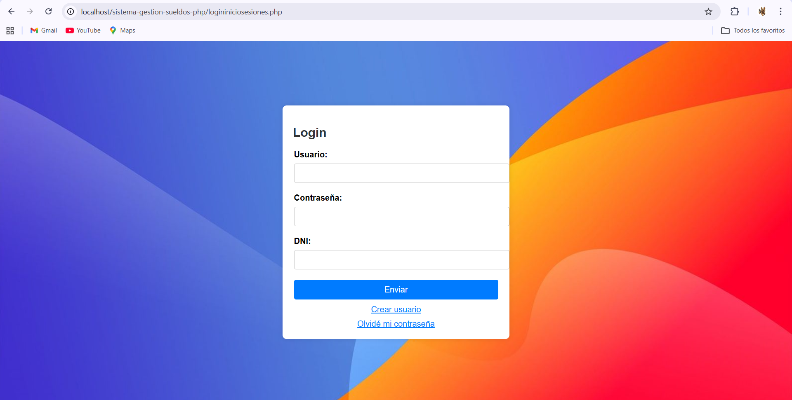
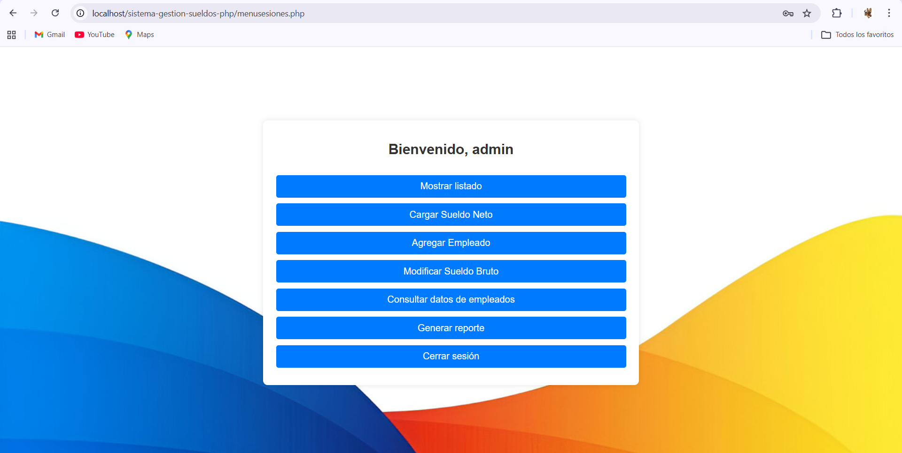
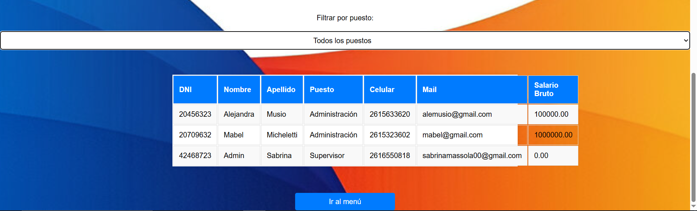

# Sistema de Gestión de Sueldos (PHP + MySQL)

Aplicación académica para administrar empleados, conceptos salariales, liquidaciones y reportes. Incluye acceso diferenciado para supervisores y empleados.

## Funcionalidades

- Alta, modificación y consulta de empleados
- Carga de conceptos salariales
- Cálculo y registro de sueldo neto por período
- Inicio de sesión con roles
- Reportes de evolución salarial

## Tecnologías

- PHP 8 y MySQL/MariaDB
- HTML, CSS y JavaScript
- Runtime comunitario `vercel-php` para el despliegue en Vercel

## Demo

La base pública de demostración no contiene información personal real.

- Usuario supervisor: `demo`
- Contraseña: `demo1234`
- DNI: `10000000`

> El esquema conserva MD5 por compatibilidad con el proyecto académico original. Para uso real debe migrarse a `password_hash()` y `password_verify()`.

## Ejecución local

1. Iniciar Apache y MySQL (por ejemplo, con XAMPP).
2. Importar `database/demo.sql`.
3. Configurar las variables que aparecen en `.env.example`.
4. Servir el directorio `api` como raíz PHP y abrir `logininiciosesiones.php`.

El volcado original se excluye del repositorio porque contiene datos personales, salarios y hashes de contraseñas.

## Despliegue en Vercel

1. Crear una base MySQL accesible desde Internet e importar `database/demo.sql`.
2. Importar este repositorio en Vercel.
3. Conectar TiDB Cloud para inyectar `TIDB_HOST`, `TIDB_PORT`, `TIDB_USER`, `TIDB_PASSWORD` y `TIDB_DATABASE`; también se admiten las variables `DB_*` de `.env.example`.
4. Desplegar. La raíz se redirige automáticamente al inicio de sesión.

PHP se ejecuta mediante el runtime comunitario `vercel-php`; Vercel no ofrece PHP como runtime oficial.

## Capturas

